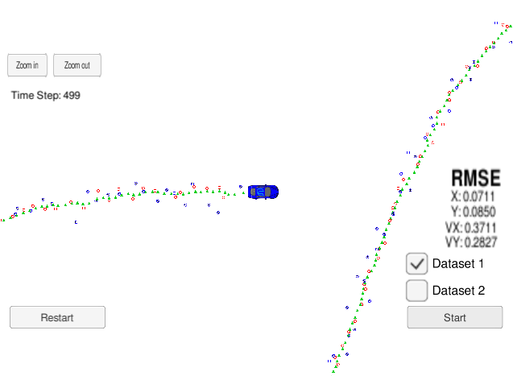

# Unscented Kalman Filter Project

### Overview
---
This repository contains files for the Unscented Kalman Filter Project.

### Set-Up

This project involves the Term 2 Simulator which can be downloaded [here](https://github.com/udacity/self-driving-car-sim/releases)

This repository includes two files that can be used to set up and install [uWebSocketIO](https://github.com/uWebSockets/uWebSockets) for either Linux or Mac systems. For windows you can use either Docker, VMware, or even [Windows 10 Bash on Ubuntu](https://www.howtogeek.com/249966/how-to-install-and-use-the-linux-bash-shell-on-windows-10/) to install uWebSocketIO. 

Once the install for uWebSocketIO is complete, the main program can be built and run by doing the following from the project top directory.

1. mkdir build
2. cd build
3. cmake ..
4. make
5. ./UnscentedKF

## Other Important Dependencies

* cmake >= 3.5
  * All OSes: [click here for installation instructions](https://cmake.org/install/)
* make >= 4.1 (Linux, Mac), 3.81 (Windows)
  * Linux: make is installed by default on most Linux distros
  * Mac: [install Xcode command line tools to get make](https://developer.apple.com/xcode/features/)
  * Windows: [Click here for installation instructions](http://gnuwin32.sourceforge.net/packages/make.htm)
* gcc/g++ >= 5.4
  * Linux: gcc / g++ is installed by default on most Linux distros
  * Mac: same deal as make - [install Xcode command line tools](https://developer.apple.com/xcode/features/)
  * Windows: recommend using [MinGW](http://www.mingw.org/)

### Write-up

#### 1. Compiling

The code compiles without errors using cmake and make.

#### 2. Accuracy
The RMSE is less than [.09, .10, .40, .30] for px, py, vx and vy respectively. 

#### 3. General Processing and Flow

As described in the lesson, the UKF's prediction step consists of generation of augmented sigma points, prediction of the next sigma points, and calculation of the mean and covariance. (lines 585-593 in ukf.cpp) The update step  consists of measurement prediction using sigma points, and state update. 

#### 4. Initialization

As shown in lines 520 to 550 of ukf.cpp, the algorithm initializes the position based on either laser or radar measurements. The covariance matrix is initialized in line 83.

#### 5. Order of Operation
The Kalman Filter first predicts (line 558 of ukf.cpp), and the updates (lines 564-572 of ukf.cpp).

#### 5. Fusion
The algorithm can handle multiple both radar and lidar measurements (lines 564-572 of ukf.cpp)..

#### 6. Efficiency
The code is compact and object-oriented without compromising readibility. When handling laser inputs (line 451), the ukf uses the standard kalman filter as the ukf would have converged to the linear case but with more computational overhead. 